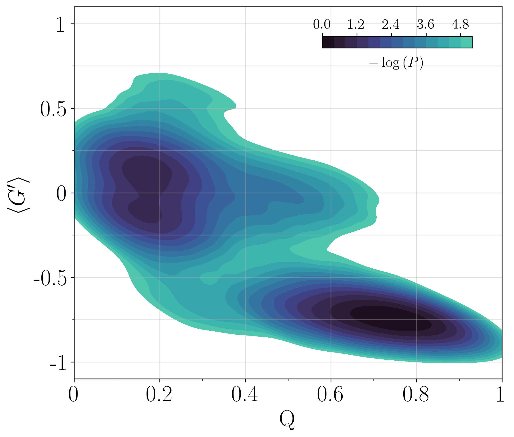

# KDE and Contour plot

This repo contains a simple wrapper to `scipy.stats.gaussian_kde` together with a visualization tool to draw 2D contour plots.

### Repo structure
- `data`: contains example data
- `kde_contour`: contains the actual functions for the KDE and the contour draw
- `example.ipynb`: jupiter notebook to show how to call the functions

### Info and contribution
This code is part of the one used for the paper [Folding Kinetics of an Entangled Protein (2023)](https://doi.org/10.1101/2023.04.17.537117). If you want to improve or suggest features, feel free to open an issue!